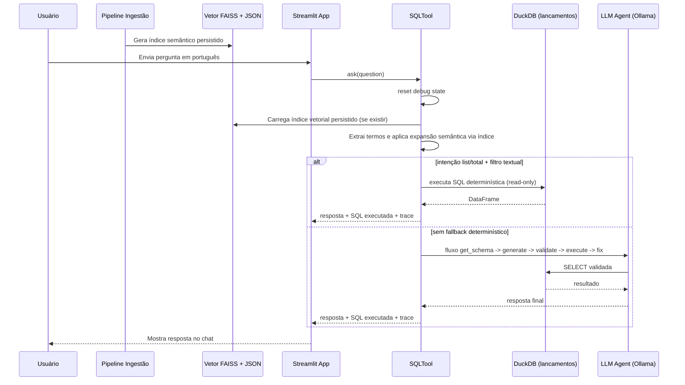

# Duck Ingest Query Bot

Um pipeline de ingestão focado em transformar PDFs locais em dados estruturados prontos para análise SQL no DuckDB e busca semântica com índice vetorial.

## Overview

- Carrega todos os PDFs encontrados em `data/raw` usando o `PDFLoader` baseado em PyMuPDF.
- Detecta documentos de imagem e, se `unstructured[all-docs]` estiver disponível, aplica OCR para extrair texto.
- Consolida cada página em um `DataFrame` e salva o resultado como um arquivo Parquet comprimido em `data/processed`.

## Requirements

- Python `>=3.9.0,<3.13.0` (sempre alinhe ao ambiente virtual que você usa).
- `pip install -r requirements.txt` traz as dependências principais (LangChain, pandas, pyarrow, faiss, openai, qwen-agent, ollama, streamlit, duckdb etc.).

## Setup

1. Entre na pasta do projeto:
   `cd /home/patriciacafundo/dev/git/duck-ingest-query-bot`
2. Ative o ambiente virtual já criado:
   `source /home/patriciacafundo/dev/venv/chatbotduckdb/bin/activate`
3. Alternativa de ativação por caminho relativo (a partir da pasta do projeto):
   `source ../../venv/chatbotduckdb/bin/activate`
4. Confirme que o Python ativo é do `venv`:
   `which python`
5. O resultado esperado deve ser:
   `/home/patriciacafundo/dev/venv/chatbotduckdb/bin/python`
6. Instale as dependências:
   `pip install -r requirements.txt`
7. Configure variáveis de ambiente em `.env` (o `config/settings.py` tenta carregá-lo) ou exporte-as diretamente.
8. Quando terminar, desative o ambiente com:
   `deactivate`

## Instalando Ollama (CLI + servidor local)

Importante: `pip install -r requirements.txt` instala apenas o cliente Python `ollama`.
O comando de terminal `ollama` (CLI) precisa ser instalado no sistema operacional.

Linux:
`curl -fsSL https://ollama.com/install.sh | sh`

macOS:
Baixe e instale em `https://ollama.com/download`

Windows:
Baixe e instale em `https://ollama.com/download`

Após instalar, valide:
1. `ollama --version`
2. `ollama serve`
3. Em outro terminal, `ollama pull qwen3`


## Executando o pipeline

1. Coloque os PDFs que deseja processar em `data/raw` (pode organizar em subpastas).
2. Rode `python src/loaders/main.py --data-dir data/raw`.
3. O script imprime o progresso de cada PDF, aplica OCR quando necessário e gera:
   - `data/processed/ingestion.parquet` (bruto por página)
   - `data/processed/razao_contabil.parquet` (estruturado por lançamento contábil)
   - `data/processed/semantic_terms.faiss` e `data/processed/semantic_terms.json` (índice vetorial + metadados)

### Exemplo de execução

```
python src/loaders/main.py --data-dir ./data/raw --data-processed ./data/processed/ingestion.parquet
```

Com indexação semântica explícita:

```bash
python src/loaders/main.py \
  --data-dir data/raw \
  --data-structured data/processed/razao_contabil.parquet \
  --semantic-enabled \
  --semantic-model-name paraphrase-multilingual-mpnet-base-v2 \
  --semantic-index-path data/processed/semantic_terms.faiss \
  --semantic-terms-path data/processed/semantic_terms.json
```

### Query em colunas no DuckDB

```sql
SELECT
  conta_codigo,
  conta_nome,
  data_lancamento,
  historico,
  valor,
  total_debito
FROM 'data/processed/razao_contabil.parquet'
WHERE cnpj = '99.999.999/9999-99'
ORDER BY conta_codigo, data_lancamento;
```

### Selecionando colunas no `main`

Você pode escolher quais colunas vão para o Parquet estruturado com `--structured-columns`:

```bash
python src/loaders/main.py \
  --data-dir data/raw \
  --structured-columns cabecalho,periodo_inicio,periodo_fim,cnpj,conta_codigo,conta_nome,data_lancamento,historico,valor,total_debito
```

Colunas permitidas:
`cabecalho, periodo_inicio, periodo_fim, cnpj, conta_codigo, conta_nome, data_lancamento, historico, valor, total_debito, arquivo, source, pagina`

Se alguma coluna for informada com nome errado, o processo falha com erro e é interrompido.

Se quiser testar apenas um subconjunto de PDFs, aponte `--data-dir` para uma pasta menor e verifique o arquivo Parquet gerado em `data/processed`.

### Observações

- O parser aceita `--data-dir`, `--data-processed`, `--data-structured`, `--structured-columns` e flags semânticas.
- `IngestionPipeline` usa o `PDFLoader` e salva o DataFrame final via `pandas.to_parquet(..., engine="pyarrow", compression="snappy")`.


## Estrutura do projeto

- `src/loaders/pdf_loader.py`: responsável por localizar PDFs, fazer o parsing com PyMuPDF e, quando necessário, aplicar OCR com `unstructured.partition.pdf`.
- `src/loaders/pipeline.py`: orquestração da ingestão (loader → storage).
- `src/loaders/main.py`: CLI trivial que instancia o pipeline e dispara `run()`.
- `src/loaders/semantic_indexer.py`: geração de índice vetorial FAISS e metadados de termos semânticos.
- `src/chatbot/sql_tool.py`: ferramenta SQL no formato passo-a-passo (`get_database_schema`, `generate_sql_query`, `validate_sql_query`, `execute_sql_query`, `fix_sql_error`).
- `src/chatbot/streamlit_app.py`: interface de chat com Streamlit usando `SQLTool` diretamente.

## Executando o chatbot

1. Garanta que o parquet estruturado já existe em `data/processed/razao_contabil.parquet`.
2. Baixe o modelo no Ollama (uma vez por máquina):
   `ollama pull qwen3`
3. Verifique se o modelo está disponível:
   `ollama list`
4. Garanta que o servidor Ollama está ativo:
   `ollama serve`
5. Configure o modelo no `.env`:
   `llm=qwen3`
6. Rode o app:
   `streamlit run src/chatbot/streamlit_app.py`

O chatbot usa instruções em português para gerar SQL no DuckDB com base na tabela `lancamentos`.
Antes de executar, a SQL é validada para permitir apenas leitura (`SELECT/CTE`) e bloquear comandos destrutivos.

### Matching semântico (PT-BR)

O `SQLTool` usa o índice vetorial persistido gerado na ingestão para expandir termos textuais (por exemplo, `telefone` -> `telefonia`), sem criar embeddings em tempo real no chatbot.

Configuração opcional via `.env`:
- `SEMANTIC_MATCH_ENABLED=true` habilita/desabilita o matcher semântico (default: `true`).
- `SEMANTIC_MODEL_NAME=paraphrase-multilingual-mpnet-base-v2` define o modelo de embeddings.
- `SEMANTIC_INDEX_PATH=data/processed/semantic_terms.faiss` caminho do índice vetorial.
- `SEMANTIC_TERMS_PATH=data/processed/semantic_terms.json` caminho dos termos/metadados.
- `SEMANTIC_LOCAL_FILES_ONLY=true` evita download de modelo em runtime.
- Se o índice vetorial não existir, o chatbot cai automaticamente para matching lexical.

### Sequência de execução (Mermaid)



### Modo debug (SELECTs gerados)

1. Inicie o app:
   `streamlit run src/chatbot/streamlit_app.py`
2. Na sidebar, habilite:
   `Modo debug (mostrar SELECTs gerados)`
3. Faça uma pergunta no chat.
4. Em cada resposta, abra:
   - `SELECTs gerados (N)` para ver as tentativas de SQL.
   - `Trace debug` para ver validação e execução.
