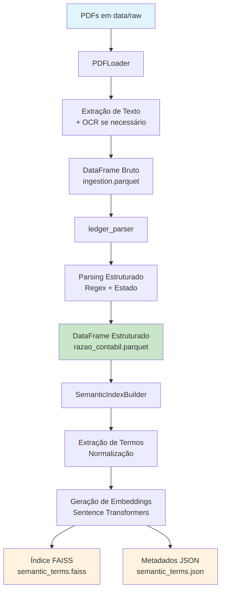
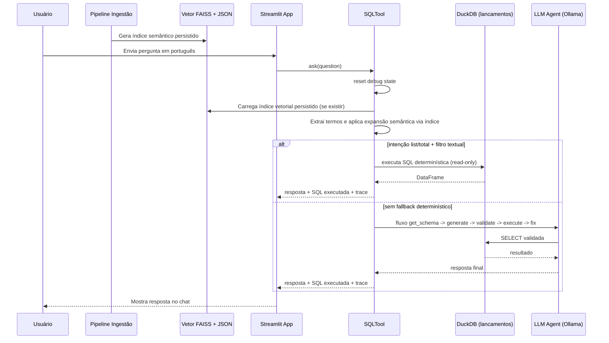

# Duck Ingest Query Bot

Um pipeline de ingestão focado em transformar PDFs locais em dados estruturados prontos para análise SQL no DuckDB e busca semântica com índice vetorial.

## Overview

- Carrega todos os PDFs encontrados em `data/raw` usando o `PDFLoader` baseado em PyMuPDF.
- Detecta documentos de imagem e, se `unstructured[all-docs]` estiver disponível, aplica OCR para extrair texto.
- Consolida cada página em um `DataFrame` e salva o resultado como um arquivo Parquet comprimido em `data/processed`.

## Requirements

- Python `>=3.9.0,<3.13.0` (sempre alinhe ao ambiente virtual que você usa).
- `pip install -r requirements.txt` traz as dependências principais (LangChain, pandas, pyarrow, faiss, openai, qwen-agent, ollama, streamlit, duckdb etc.).

## Setup

1. Entre na pasta do projeto:
   `cd /home/patriciacafundo/dev/git/duck-ingest-query-bot`
2. Ative o ambiente virtual já criado:
   `source /home/patriciacafundo/dev/venv/chatbotduckdb/bin/activate`
3. Alternativa de ativação por caminho relativo (a partir da pasta do projeto):
   `source ../../venv/chatbotduckdb/bin/activate`
4. Confirme que o Python ativo é do `venv`:
   `which python`
5. O resultado esperado deve ser:
   `/home/patriciacafundo/dev/venv/chatbotduckdb/bin/python`
6. Instale as dependências:
   `pip install -r requirements.txt`
7. Configure variáveis de ambiente em `.env` (o `config/settings.py` tenta carregá-lo) ou exporte-as diretamente.
8. Quando terminar, desative o ambiente com:
   `deactivate`

## Instalando Ollama (CLI + servidor local)

Importante: `pip install -r requirements.txt` instala apenas o cliente Python `ollama`.
O comando de terminal `ollama` (CLI) precisa ser instalado no sistema operacional.

Linux:
`curl -fsSL https://ollama.com/install.sh | sh`

macOS:
Baixe e instale em `https://ollama.com/download`

Windows:
Baixe e instale em `https://ollama.com/download`

Após instalar, valide:
1. `ollama --version`
2. `ollama serve`
3. Em outro terminal, `ollama pull qwen3`


## Executando o pipeline

1. Coloque os PDFs que deseja processar em `data/raw` (pode organizar em subpastas).
2. Rode `python src/loaders/main.py --data-dir data/raw`.
3. O script imprime o progresso de cada PDF, aplica OCR quando necessário e gera:
   - `data/processed/ingestion.parquet` (bruto por página)
   - `data/processed/razao_contabil.parquet` (estruturado por lançamento contábil)
   - `data/processed/semantic_terms.faiss` e `data/processed/semantic_terms.json` (índice vetorial + metadados)

### Exemplo de execução

```
python src/loaders/main.py --data-dir ./data/raw --data-processed ./data/processed/ingestion.parquet
```

Com indexação semântica explícita:

```bash
python src/loaders/main.py \
  --data-dir data/raw \
  --data-structured data/processed/razao_contabil.parquet \
  --semantic-enabled \
  --semantic-model-name paraphrase-multilingual-mpnet-base-v2 \
  --semantic-index-path data/processed/semantic_terms.faiss \
  --semantic-terms-path data/processed/semantic_terms.json
```

### Query em colunas no DuckDB

```sql
SELECT
  conta_codigo,
  conta_nome,
  data_lancamento,
  historico,
  valor,
  total_debito
FROM 'data/processed/razao_contabil.parquet'
WHERE cnpj = '99.999.999/9999-99'
ORDER BY conta_codigo, data_lancamento;
```

### Selecionando colunas no `main`

Você pode escolher quais colunas vão para o Parquet estruturado com `--structured-columns`:

```bash
python src/loaders/main.py \
  --data-dir data/raw \
  --structured-columns cabecalho,periodo_inicio,periodo_fim,cnpj,conta_codigo,conta_nome,data_lancamento,historico,valor,total_debito
```

Colunas permitidas:
`cabecalho, periodo_inicio, periodo_fim, cnpj, conta_codigo, conta_nome, data_lancamento, historico, valor, total_debito, arquivo, source, pagina`

Se alguma coluna for informada com nome errado, o processo falha com erro e é interrompido.

Se quiser testar apenas um subconjunto de PDFs, aponte `--data-dir` para uma pasta menor e verifique o arquivo Parquet gerado em `data/processed`.

### Observações

- O parser aceita `--data-dir`, `--data-processed`, `--data-structured`, `--structured-columns` e flags semânticas.
- `IngestionPipeline` usa o `PDFLoader` e salva o DataFrame final via `pandas.to_parquet(..., engine="pyarrow", compression="snappy")`.


## Pipeline de Ingestão Detalhada

O pipeline de ingestão é composto por três etapas principais executadas sequencialmente: **Carregamento de PDFs**, **Parsing Estruturado** e **Indexação Semântica**. Cada etapa é modular e pode ser configurada independentemente.

### 1. Carregamento de PDFs (`PDFLoader`)

**Objetivo**: Extrair texto de documentos PDF, incluindo suporte a OCR para PDFs de imagem.

**Processo detalhado**:
1. **Descoberta de arquivos**: Varre recursivamente o diretório `data/raw` procurando por arquivos `.pdf`
2. **Extração de texto nativo**: Usa PyMuPDF para extrair texto diretamente dos PDFs
3. **Detecção de PDFs de imagem**: Conta caracteres extraídos; se < 100 caracteres, considera PDF de imagem
4. **Aplicação de OCR**: Para PDFs de imagem, usa `unstructured.partition.pdf` com estratégia `hi_res` e idioma português
5. **Normalização**: Padroniza metadados (autor, data, página, etc.) e conteúdo de texto
6. **Consolidação**: Junta todas as páginas em um único DataFrame pandas

**Saídas**:
- DataFrame com colunas: `id`, `metadata`, `page_content`, `type`
- Metadados incluem: `source`, `page`, `total_pages`, `author`, `creationDate`, etc.

**Configuração**:
- `use_ocr=True` (padrão): Habilita OCR automático
- Requer `unstructured[all-docs]` para OCR (opcional)

**Tratamento de erros**:
- PDFs corrompidos são pulados com aviso
- Falha no OCR cai para texto nativo (se disponível)

### 2. Parsing Estruturado (`ledger_parser`)

**Objetivo**: Converter texto bruto de páginas PDF em dados estruturados de lançamentos contábeis.

**Algoritmo de parsing**:
1. **Identificação de cabeçalho**: Busca padrão "RAZÃO POR CONTA CONTÁBIL"
2. **Extração de metadados globais**:
   - Período base (formato DD/MM/YYYY a DD/MM/YYYY)
   - CNPJ (formato XX.XXX.XXX/XXXX-XX)
3. **Parsing linha-a-linha** usando máquina de estados:
   - **Estado conta**: Detecta códigos de conta (XX.XX.XX) seguidos de nome
   - **Estado data**: Identifica datas de lançamento (DD/MM/YYYY)
   - **Estado histórico**: Coleta texto descritivo até encontrar valor
   - **Estado valor**: Extrai valores monetários (formato brasileiro: 1.234,56)
4. **Associação de totais**: Valores de "Total débito" são retro-associados aos lançamentos da conta
5. **Validação**: Verifica consistência de dados e formatação

**Estrutura de dados resultante**:
```python
{
    'cabecalho': str,           # Título do documento
    'periodo_inicio': str,      # Data início (DD/MM/YYYY)
    'periodo_fim': str,         # Data fim (DD/MM/YYYY)
    'cnpj': str,                # CNPJ formatado
    'conta_codigo': str,        # Código da conta (XX.XX.XX)
    'conta_nome': str,          # Nome da conta
    'data_lancamento': str,     # Data do lançamento
    'historico': str,           # Descrição do lançamento
    'valor': float,             # Valor do lançamento
    'total_debito': float,      # Total de débito da conta
    'arquivo': str,             # Nome do arquivo PDF
    'source': str,              # Caminho completo do PDF
    'pagina': int               # Número da página
}
```

**Expressões regulares utilizadas**:
- `PERIODO_RE`: `r"Período base:\s*(\d{2}/\d{2}/\d{4})\s*a\s*(\d{2}/\d{2}/\d{4})"`
- `CNPJ_RE`: `r"\d{2}\.\d{3}\.\d{3}/\d{4}-\d{2}"`
- `CONTA_RE`: `r"^(\d{2}\.\d{2}\.\d{2})\s+(.+)$"`
- `VALOR_RE`: `r"^(-?\d{1,3}(?:\.\d{3})*,\d{2})$"`

### 3. Indexação Semântica (`SemanticIndexBuilder`)

**Objetivo**: Criar índice vetorial FAISS para busca semântica de termos textuais.

**Processo detalhado**:
1. **Extração de termos**: Coleta termos únicos de colunas textuais (`conta_nome`, `historico`)
2. **Normalização**: Remove acentos, converte para minúscula, filtra stopwords
3. **Filtragem**: Remove termos muito curtos (< 3 chars) e stopwords em português
4. **Geração de embeddings**: Usa Sentence Transformers para converter termos em vetores
5. **Construção do índice**: Cria índice FAISS para busca vetorial eficiente
6. **Persistência**: Salva índice binário (.faiss) e metadados JSON (.json)

**Modelo padrão**: `paraphrase-multilingual-mpnet-base-v2` (suporte português)
**Dimensão dos vetores**: 768 (depende do modelo)
**Métricas de busca**: Similaridade cosseno

**Arquivos gerados**:
- `semantic_terms.faiss`: Índice vetorial FAISS
- `semantic_terms.json`: Mapeamento termo → embedding + metadados

**Configuração**:
- `semantic_enabled`: Habilita/desabilita indexação (padrão: true)
- `semantic_model_name`: Modelo de embeddings
- `semantic_local_files_only`: Força uso de modelos locais (padrão: true)

### Fluxo de Dados Completo

```
PDFs em data/raw/
    ↓
PDFLoader.load()
    ↓ [DataFrame bruto por página]
data/processed/ingestion.parquet
    ↓
parse_ledger_dataframe()
    ↓ [DataFrame estruturado por lançamento]
data/processed/razao_contabil.parquet
    ↓
SemanticIndexBuilder.build()
    ↓ [Índice vetorial + metadados]
data/processed/semantic_terms.faiss
data/processed/semantic_terms.json
```

### Diagrama da Pipeline



### Configurações Avançadas

**Seleção de colunas estruturadas**:
```bash
--structured-columns cabecalho,periodo_inicio,cnpj,conta_codigo,data_lancamento,historico,valor
```

**Controle de indexação semântica**:
```bash
--semantic-enabled true \
--semantic-model-name paraphrase-multilingual-mpnet-base-v2 \
--semantic-index-path data/processed/custom_index.faiss
```

### Performance e Otimização

- **Compressão**: Arquivos Parquet usam Snappy compression
- **Memória**: Processamento em chunks para PDFs grandes
- **Paralelização**: Múltiplos PDFs processados sequencialmente
- **Cache**: Modelos de embeddings são cacheados localmente
- **Fallback**: OCR opcional permite processamento sem `unstructured`

### Tratamento de Erros

- **PDFs corrompidos**: Pulados com log de aviso
- **Parsing falha**: Documentos problemáticos geram warnings, não interrompem pipeline
- **Modelo indisponível**: Indexação semântica desabilitada automaticamente
- **Espaço em disco**: Verificação de espaço antes de salvar arquivos grandes

### Schema de Dados

**DataFrame Bruto (ingestion.parquet)**:
```python
{
    "id": int,              # ID sequencial da página
    "metadata": dict,       # Metadados do PDF (autor, data, página, etc.)
    "page_content": str,    # Texto extraído da página
    "type": str            # Tipo do documento ("Document")
}
```

**DataFrame Estruturado (razao_contabil.parquet)**:
```python
{
    "cabecalho": str,           # Título do relatório
    "periodo_inicio": str,      # Data início período (DD/MM/YYYY)
    "periodo_fim": str,         # Data fim período (DD/MM/YYYY)  
    "cnpj": str,                # CNPJ da empresa
    "conta_codigo": str,        # Código contábil (XX.XX.XX)
    "conta_nome": str,          # Nome da conta contábil
    "data_lancamento": str,     # Data do lançamento (DD/MM/YYYY)
    "historico": str,           # Descrição do lançamento
    "valor": float,             # Valor do lançamento
    "total_debito": float,      # Total de débito da conta
    "arquivo": str,             # Nome do arquivo PDF origem
    "source": str,              # Caminho completo do PDF
    "pagina": int               # Número da página
}
```

**Índice Semântico**:
- **semantic_terms.faiss**: Índice vetorial FAISS para busca rápida
- **semantic_terms.json**: Metadados com mapeamento termo → informações

### Monitoramento e Debug

O pipeline imprime progresso detalhado:
```
🚀 Iniciando pipeline de ingestão...
📄 Carregando PDFs...
   Processando arquivo: razao_contabil_q1.pdf
   🖼️  Detectado PDF de imagem, aplicando OCR...
   ✓ 15 páginas processadas
✅ Parquet bruto salvo em data/processed/ingestion.parquet
🧾 Estruturando lançamentos contábeis...
✅ Parquet estruturado salvo em data/processed/razao_contabil.parquet
🧠 Gerando índice semântico...
✅ Índice semântico salvo (1,247 termos indexados)
```

## Estrutura do projeto

- `src/loaders/pdf_loader.py`: responsável por localizar PDFs, fazer o parsing com PyMuPDF e, quando necessário, aplicar OCR com `unstructured.partition.pdf`.
- `src/loaders/pipeline.py`: orquestração da ingestão (loader → storage).
- `src/loaders/main.py`: CLI trivial que instancia o pipeline e dispara `run()`.
- `src/loaders/semantic_indexer.py`: geração de índice vetorial FAISS e metadados de termos semânticos.
- `src/chatbot/sql_tool.py`: ferramenta SQL no formato passo-a-passo (`get_database_schema`, `generate_sql_query`, `validate_sql_query`, `execute_sql_query`, `fix_sql_error`).
- `src/chatbot/streamlit_app.py`: interface de chat com Streamlit usando `SQLTool` diretamente.

## Executando o chatbot

1. Garanta que o parquet estruturado já existe em `data/processed/razao_contabil.parquet`.
2. Baixe o modelo no Ollama (uma vez por máquina):
   `ollama pull qwen3`
3. Verifique se o modelo está disponível:
   `ollama list`
4. Garanta que o servidor Ollama está ativo:
   `ollama serve`
5. Configure o modelo no `.env`:
   `llm=qwen3`
6. Rode o app:
   `streamlit run src/chatbot/streamlit_app.py`

O chatbot usa instruções em português para gerar SQL no DuckDB com base na tabela `lancamentos`.
Antes de executar, a SQL é validada para permitir apenas leitura (`SELECT/CTE`) e bloquear comandos destrutivos.

### Usando OpenAI Mini no chatbot

Exemplo de `.env` para usar OpenAI no lugar de Ollama:

```env
OPENAI_API_KEY=...
LLM_PROVIDER=openai
OPENAI_MODEL=gpt-4.1-mini
```

Regra de seleção do provider no `SQLTool`:
1. `LLM_PROVIDER=openai` força OpenAI.
2. `LLM_PROVIDER=ollama` força Ollama.
3. Sem `LLM_PROVIDER`:
   - se `OPENAI_API_KEY` existir, usa OpenAI;
   - senão, usa Ollama.

Resolução do modelo:
- OpenAI: `OPENAI_MODEL` (fallback: `LLM`/`llm`, fallback final `gpt-4.1-mini`).
- Ollama: `LLM`/`llm` (fallback final `qwen3`).

Exemplos rápidos:

```env
# Forçar local
LLM_PROVIDER=ollama
LLM=qwen3:4b
```

```env
# Forçar OpenAI
LLM_PROVIDER=openai
OPENAI_MODEL=gpt-4.1-mini
```

Observação sobre vetores:
- trocar apenas o LLM (Ollama -> OpenAI) não exige reindexar vetores;
- só reindexe se trocar o modelo de embeddings da etapa de indexação semântica.

### Matching semântico (PT-BR)

O `SQLTool` usa o índice vetorial persistido gerado na ingestão para expandir termos textuais (por exemplo, `telefone` -> `telefonia`), sem criar embeddings em tempo real no chatbot.

Configuração opcional via `.env`:
- `SEMANTIC_MATCH_ENABLED=true` habilita/desabilita o matcher semântico (default: `true`).
- `SEMANTIC_MODEL_NAME=paraphrase-multilingual-mpnet-base-v2` define o modelo de embeddings.
- `SEMANTIC_INDEX_PATH=data/processed/semantic_terms.faiss` caminho do índice vetorial.
- `SEMANTIC_TERMS_PATH=data/processed/semantic_terms.json` caminho dos termos/metadados.
- `SEMANTIC_LOCAL_FILES_ONLY=true` força o `sentence-transformers` a usar somente modelos já
  disponíveis localmente (sem download).
- Se `SEMANTIC_LOCAL_FILES_ONLY=true` e o modelo não estiver no cache local:
  - Na ingestão, a criação do índice falha e o pipeline segue sem o índice.
  - No chatbot, a expansão semântica é desativada e o matching cai para o modo lexical.
- Se `SEMANTIC_LOCAL_FILES_ONLY=false`, o modelo pode ser baixado do hub automaticamente
  quando não existir no cache local.
- Se o índice vetorial não existir, o chatbot cai automaticamente para matching lexical.

### Sequência de execução (Mermaid)



### Modo debug (SELECTs gerados)

1. Inicie o app:
   `streamlit run src/chatbot/streamlit_app.py`
2. Na sidebar, habilite:
   `Modo debug (mostrar SELECTs gerados)`
3. Faça uma pergunta no chat.
4. Em cada resposta, abra:
   - `SELECTs gerados (N)` para ver as tentativas de SQL.
   - `Trace debug` para ver validação e execução.


source ../../venv/chatbotduckdb/bin/activate
